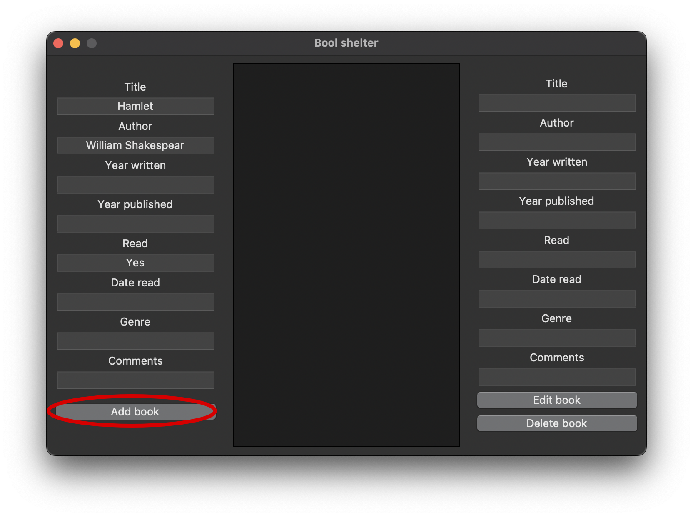
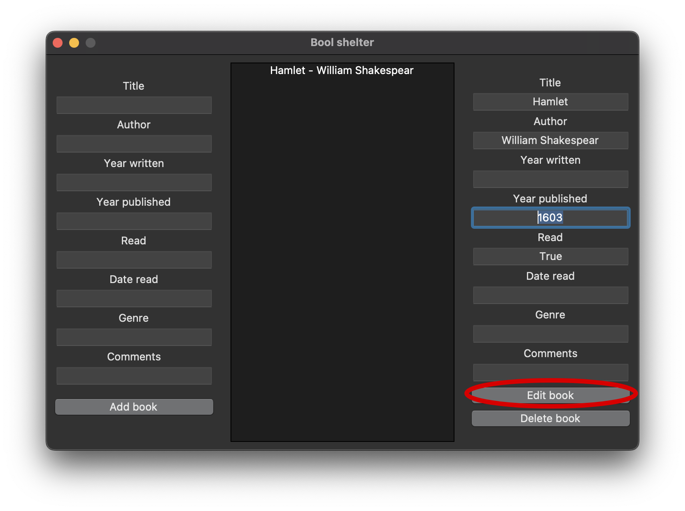
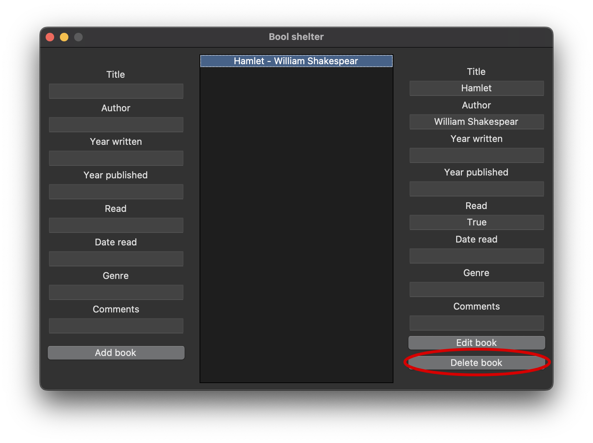

# Book Shelter
App to track personal library

## Usage

### How to run
You can switch language in `settings.py` file by editing `_LANGUAGE_NAME` variable.
Then run `main.py`.

### Book adding
You can add new book in the left block section. The "title" and "author" fields must be filled in.
After complition press `Add book` button.

### Book editing
In the middle section select the book from listed ones, then add information in the right block section. After complition press `Edit book` button.

### Book editing
In the middle section select the book from listed ones, then press `Delete book` button.
